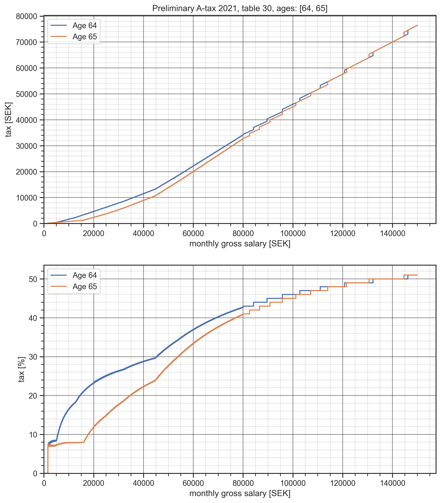

# Skattplott

A Jupyter Notebook that visualises salary tax rates in Sweden. It uses the local Python package `atax` for the calculations. `atax` is a basic table-lookup-wrapper around raw text data files from Skatteverket.

It produces plots like this one:

And this one:

## Prerequisites

    1. A somewhat recent version of Python, only tested on Python 3.9 🐍
    2. An interest in salary tax rates in Sweden 😳 💸

## Getting started

Assuming you have Python available, open a new terminal, `cd` to the root of this repo.

Then, to set-up a new `venv` and install the dependencies (a dedicated `venv` not stricly required, but recommended):

    $ python -m venv env
    $ . env/bin/activate
    $ python -m pip install --upgrade pip
    $ pip install -r requirements.lock

To start the Jupyter Notebook:

    $ jupyter-notebook skattplot.ipynb

## Tests

Note: Before running the tests, make sure you have initialized your `venv` and installed dependencies as described above.

    $ pytest -v

To have pytest re-run on code changes, instead do:

    $ ptw -c

## Adding updated A-tax rate data

The raw data from Skatteverket in Sweden is located here:

    $ ls -l ./atax/data/

The files here are `*.txt` files (fixed width columns) downloadable from [Skatteverket](https://www.skatteverket.se/specialversionerforprogramforetagmfl.4.319dc1451507f2f99e86ee.html).
